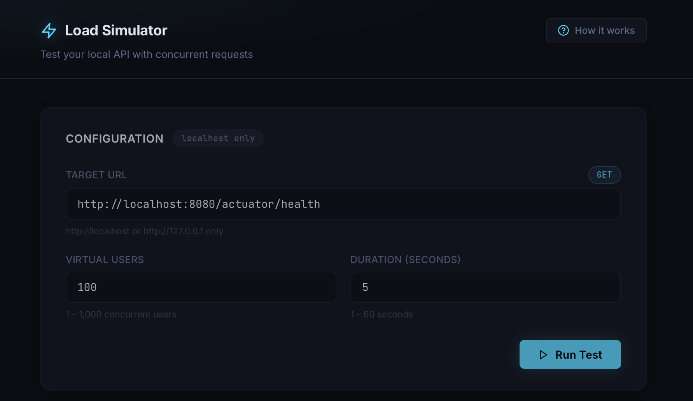
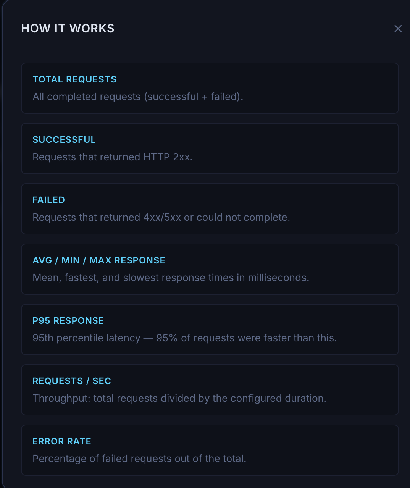
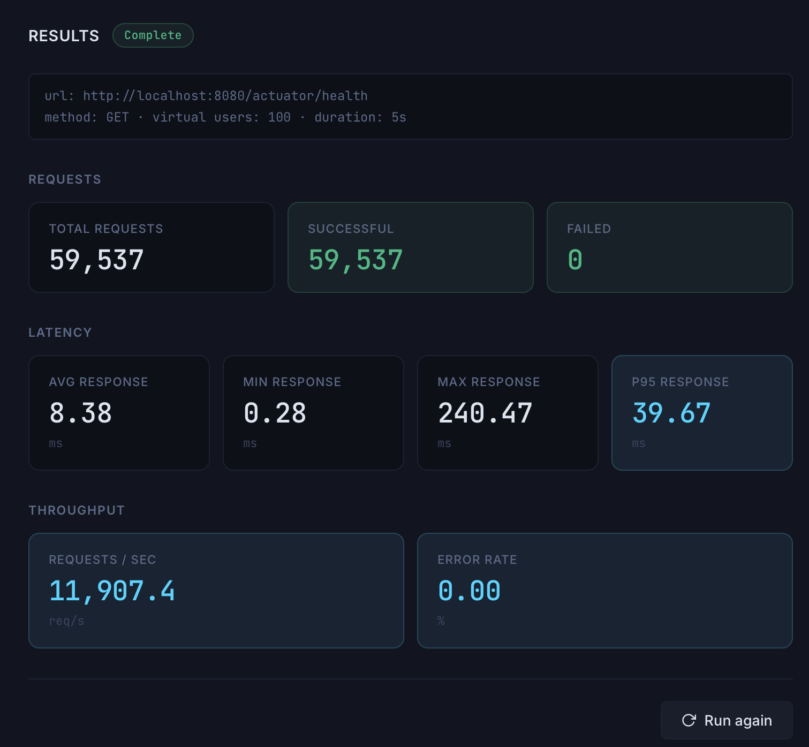
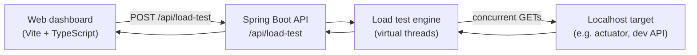

# Load Simulator

A full-stack localhost load-testing tool. Configure virtual users and duration, hammer a local API with concurrent GET requests, and view aggregated latency and throughput metrics in a web dashboard or via the REST API.

## What it does

The simulator accepts a target URL and load profile, then runs multiple virtual users in parallel for a fixed duration. Each virtual user repeatedly sends HTTP GET requests until the global deadline is reached. When the run completes, the API returns request counts, latency statistics, throughput, and error rate.

The frontend dashboard submits tests, shows live progress, and displays results. The backend can also be used on its own with `curl`.

## Screenshots

### Configuration



### How It Works



### Results



## Why it is useful

Local backend services often need quick feedback on throughput and latency under concurrent load. Full load-testing platforms can be heavy for early development. This project provides a focused tool for safe, localhost-only smoke and stress checks during API development, debugging, and portfolio demonstrations.

## Architecture



## Core features

- **Web dashboard** — configure tests, view metrics, inline validation, and a built-in metric glossary
- **Synchronous load test API** — one request in, one result out
- **Virtual-user concurrency** — each user runs on a Java virtual thread
- **Duration-based execution** — workers loop until a shared deadline
- **Aggregated metrics** — counts, latency stats, throughput, and error rate
- **Request validation** — rejects invalid input before a test starts
- **Localhost safety guard** — only `http://localhost` and `http://127.0.0.1` targets are allowed
- **Automated tests** — validation, safety rules, metrics, and controller coverage

## Tech stack

| Layer | Technology |
|---|---|
| Backend language | Java 25 |
| Backend framework | Spring Boot 4.0.6 |
| API | Spring Web MVC |
| Validation | Jakarta Bean Validation |
| HTTP client | `java.net.http.HttpClient` |
| Concurrency | Java virtual threads (`Executors.newVirtualThreadPerTaskExecutor`) |
| Observability | Spring Actuator |
| Backend build | Maven |
| Backend testing | JUnit 5, Spring Boot Test, MockMvc |
| Frontend | Vite, TypeScript, vanilla HTML/CSS |

## Project structure

```
load-simulator/
├── backend/                    Spring Boot API and load test engine
│   └── src/main/java/com/mohammed/loadsimulator/
│       ├── controller/         REST API entry point
│       ├── service/            Application service layer
│       ├── engine/             Load test execution, HTTP runner, metrics
│       ├── dto/                Request/response models and validators
│       ├── config/             CORS and other configuration
│       └── exception/          API error handling
├── frontend/                   Vite dashboard
│   ├── index.html
│   └── src/
│       ├── main.ts             Form, API calls, modal, results UI
│       └── style.css
└── pom.xml                     Maven parent (backend module)
```

## Run locally

### Prerequisites

- Java 25
- Maven 3.9+ (or use `./mvnw` in `backend/`)
- Node.js 18+ and npm (for the frontend)

### 1. Start the backend

```bash
git clone <repository-url>
cd load-simulator/backend
./mvnw spring-boot:run
```

The API starts on **http://localhost:8080** by default.

### 2. Start the frontend

In a second terminal:

```bash
cd load-simulator/frontend
npm install
npm run dev
```

Open **http://localhost:5173**. During development, Vite proxies `/api` to the backend — no extra configuration needed.

### Frontend environment variables

Optional. See `frontend/.env.example`.

| Variable | Default | Purpose |
|---|---|---|
| `VITE_API_BASE` | *(empty in dev)* | Backend URL when not using the Vite dev proxy (e.g. `vite preview`) |

Example for preview mode:

```bash
VITE_API_BASE=http://localhost:8080 npm run preview
```

## Test the API with curl

The dashboard is the easiest way to run tests. You can also call the API directly.

**Optional — start a separate local target:**

```bash
python3 -m http.server 8081
```

**Run a load test against Spring Actuator:**

```bash
curl -s -X POST http://localhost:8080/api/load-test \
  -H "Content-Type: application/json" \
  -d '{
    "url": "http://localhost:8080/actuator",
    "method": "GET",
    "virtualUsers": 5,
    "durationSeconds": 5
  }'
```

**Run against the Python server:**

```bash
curl -s -X POST http://localhost:8080/api/load-test \
  -H "Content-Type: application/json" \
  -d '{
    "url": "http://localhost:8081/",
    "method": "GET",
    "virtualUsers": 10,
    "durationSeconds": 10
  }'
```

**Tip:** Verify the target returns HTTP 2xx before load testing. A URL that returns 404 or 405 will produce a high error rate by design.

## API overview

| Method | Path | Description |
|---|---|---|
| `POST` | `/api/load-test` | Run a synchronous load test and return aggregated metrics |
| `GET` | `/actuator` | Spring Actuator endpoint (useful as a local test target) |

### Request body

| Field | Type | Required | Constraints |
|---|---|---|---|
| `url` | string | yes | Non-blank. Must be `http://localhost...` or `http://127.0.0.1...` |
| `method` | string | yes | Must be `GET` (case-insensitive) |
| `virtualUsers` | integer | yes | 1–1000 |
| `durationSeconds` | integer | yes | 1–60 |

### Example request

```json
{
  "url": "http://localhost:8080/actuator",
  "method": "GET",
  "virtualUsers": 10,
  "durationSeconds": 10
}
```

### Example success response

```json
{
  "totalRequests": 842,
  "successfulRequests": 842,
  "failedRequests": 0,
  "averageResponseTimeMs": 12.4,
  "minResponseTimeMs": 1.2,
  "maxResponseTimeMs": 45.6,
  "p95ResponseTimeMs": 28.1,
  "requestsPerSecond": 84.2,
  "errorRate": 0.0
}
```

### Example validation error response

HTTP `400 Bad Request`

```json
{
  "message": "Validation failed",
  "errors": {
    "url": "url must not be blank"
  }
}
```

## Validation and safety rules

### Input validation

- `url` must not be blank
- `method` must not be blank
- `virtualUsers` must be between 1 and 1000
- `durationSeconds` must be between 1 and 60
- `method` must be `GET`

### Localhost-only safety

Targets must use:

- `http://localhost`
- `http://127.0.0.1`

The following are rejected:

- External domains (for example `http://example.com`)
- Private IPs other than `127.0.0.1`
- Non-HTTP schemes (for example `https://localhost`)

This keeps the tool suitable for local development and reduces accidental misuse.

### Request outcome rules

| Outcome | Treated as |
|---|---|
| HTTP 2xx | Success |
| HTTP 4xx / 5xx | Failure |
| Connection errors / timeouts | Failure |

Each virtual user uses a 5s connect timeout and 10s request timeout.

## Metrics

| Metric | Description |
|---|---|
| `totalRequests` | Total completed requests (`successfulRequests + failedRequests`) |
| `successfulRequests` | Requests that returned HTTP 2xx |
| `failedRequests` | Requests that returned 4xx/5xx or failed to connect/timed out |
| `averageResponseTimeMs` | Mean response time across all completed requests |
| `minResponseTimeMs` | Fastest observed response time |
| `maxResponseTimeMs` | Slowest observed response time |
| `p95ResponseTimeMs` | 95th percentile latency (nearest-rank method) |
| `requestsPerSecond` | `totalRequests / durationSeconds` using the configured duration |
| `errorRate` | `(failedRequests / totalRequests) × 100` as a percentage |

If no requests complete, all metrics return `0`.

## Design decisions

- **Localhost-only targets** — prevents the simulator from being used as an open HTTP relay against external sites.
- **Synchronous API** — the client waits for the full run to finish. Simple to reason about for a dev tool; not intended for distributed production load testing.
- **Virtual threads** — cheap concurrency for many simulated users without tying up OS threads.
- **No database** — each run is stateless. Results live in the response (and the UI), not persisted history.
- **1,000 user cap** — practical guardrail for local machines; higher values can overwhelm localhost services and the simulator itself.

## Run tests

From the `backend/` directory:

```bash
./mvnw test
```

Run a single test class:

```bash
./mvnw test -Dtest=LoadTestRequestValidationTest
```

Build the frontend:

```bash
cd frontend
npm run build
```
